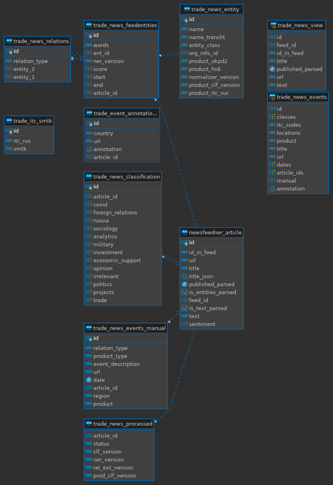

# Trade-news-backend

Модифицированная версия на базе репозитория <http://10.8.0.4:3050/trade-news/trade_news_django.git>

Aгрегатор новостных лент за текущие сутки c распознаванием именованных сущностей, отношением между ними и фильтрацией торговых новостей.

На данный момент показывается те новости, которые были расклассифицированы как относящиеся к торговой тематике и которые содержат сущности, отмеченные типом PRODUCT, и которые содержат код СМТК в таблице trade_news_entity.

Есть возможность фильтрации по странам, кодам СМТК и категориям новостей.

Данный репозиторий фокусируется на бэкенд-части приложения.

Сбор и обработка новостей осуществляется в отдельном


Фронтенд представлен в отдельном


Вся логика бэкенда в 

## Локальная установка

* первоначальная установка (с помощью `venv` в `python3`)
  
```bash
git clone http://10.8.0.4:3050/trade-news/trade_news_django/
cd trade_news_django
python3 -m venv env
source ./env/bin/activate
pip install -U pip
pip install -r requirements.txt
```

* Прописать в settings.py данные БД

* Запустить веб-сервис

```bash
python3 manage.py runserver
```

## Структура БД



### Таблица newsfeedner_article

    Содержит все статьи торговой тематики.

### Таблица trade_news_classification

    Содержит ссылку на newsfeedner_article и
    данные по результатам модели классификации

### Материализованное представление trade_news_view

    JOIN между newsfeedner_article и trade_news_classification
    с устраивающими нас типами классов
    (investment >= 0.5 OR projects >= 0.5 OR trade >= 0.5)

### Таблица trade_news_feedentities

    Хранятся выделенные сущности в тексте с положением в тексте    

### Таблица trade_news_entity

    Нормализованные сущности (уже без привязки к тексту).
    Для типа PRODUCT там же хранятся коды СМТК.

### Таблица trade_news_relations

    Отношения между сущностями из trade_news_feedentities

### Материализованное представление trade_news_events

    Осуществляет первичную фильтрацию по сущностям.
    Осуществляет увязку автоматически отобранных новостей 
    Выводится в качестве результата бэкенда торговых новостей.
    Если новость содержит пустой текст, то не добавляется.

## Логика фильтрации новостей

Новости в первую очередь фильтруются на этапе материальных представлений
(materialized view) `trade_news_view` и `trade_news_events`.

Остаются новости торговой тематики, которые содержат продукт с распознанным
кодом СМТК.

## Логика генерации краткого содержания

На данный момент эвристика.
Если есть страна в фильтре, то остаются предложения, её содержащие.
Если нет страны, но определена только одна страна, то остаются предложения,
её содержащие.

# Изменения в текущем проекте

### Добавлен раздел `api_news`, в котором реализованы новые конечные точки с доступом GET и POST

##### `/api_news/news_relevant` для работы с таблицей `trade_news_relevant` #####

##### `/api_news/news` - для работы с таблицей `trade_news_events` #####

##### `/api_news/news_approval` для работы с таблицей `trade_news_for_approval` #####

##### `/api_news/news_relevant_to_xlsx` для скачивания новостей в виде файла в формате xlsx  в соответствии с установленными значениями фильтров

##### Обращение к конечной точке `/api_news/news_approval/` по методу POST и передаче id равным пустой строке, можно добавять новость в таблицу `trade_news_relevant`
